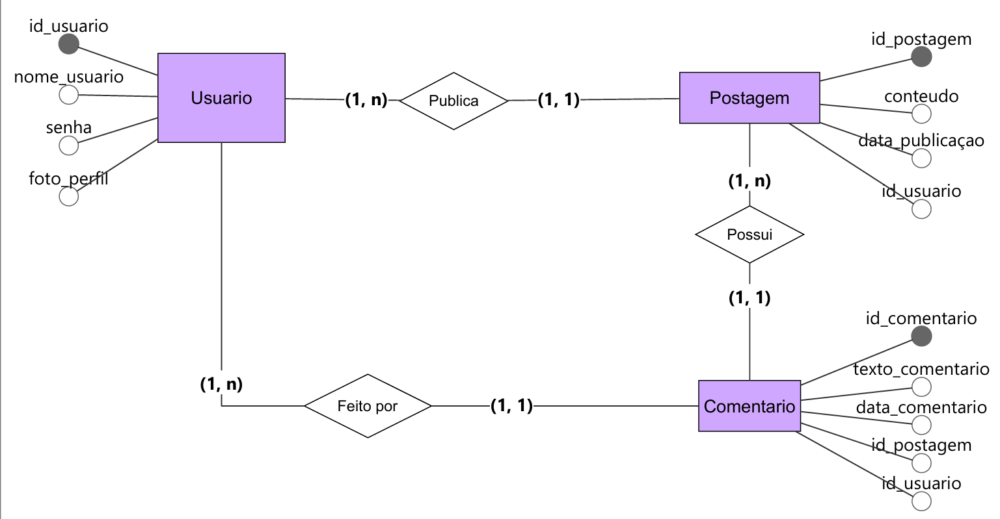
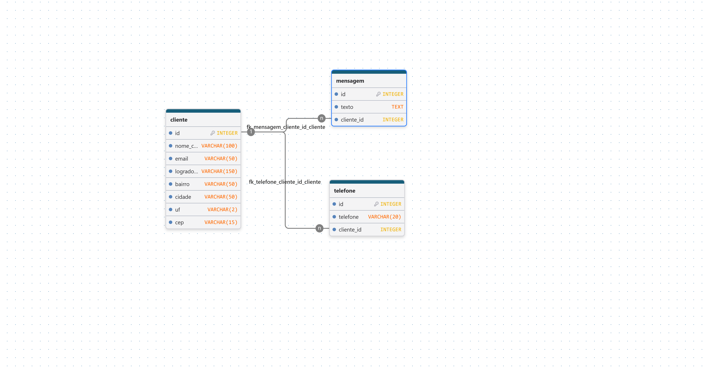

# Projeto de Banco de Dados

  

**Nome do projeto:** **Sistema de Rede Social**
**Equipe de desenvolvimento:** Luiza, Camila, Manu e Maria

## 1. Visão Geral do Sistema (Escopo)
O sistema de **Rede Social** tem como objetivo permitir que os usuários realizem postagens e interajam por meio de comentário

## 2. Regras de Negócios (RN)

**RN01:** O sistema deve permitir o cadastro de usuários. As informações necessárias são:

- Nome
- E-mail
- Senha

  **RN02:** O sistema deve permitir que o usuário faça postagens. As informações necessárias são:
- Conteúdo
- Data e hora

**RN03:** O sistema deve permitir que os usuários façam comentários nas postagens. As informações necessárias são: 

- Conteúdo do comentário
- Data e hora

## 3. Requisitos Funcionais (RF)

**RF01:** O sistema deve permitir o cadastro de usuários.
**RF02:** O sistema deve permitir que o usuário faça uma postagem.
**RF03:** O sistema deve permitir que o usuário visualize as postagens.
**RF04:** O sistema deve permitir que o usuário faça comentários nas postagens.
**RF05:** O sistema deve permitir que o usuário visualize os comentários.

## Modelagem Conceitual

## Modelo Logico
 